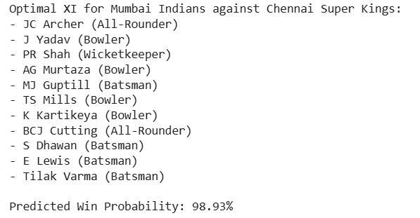

# IPL Strategy Optimization: Match Winner Prediction & Playing XI Selection

## 🏏 Project Overview
This project implements a multi-stage machine learning and optimization pipeline designed to solve two core problems in sports analytics:
1. **Match Outcome Prediction:** Estimating the win probability of a match based on the contextual strengths of two competing squads.
2. **Optimal Playing XI Selection:** A constraint-based optimization problem to select the best 11-player lineup that maximizes the predicted win probability.

## 📊 Dataset Description
The model is trained on a comprehensive historical dataset of the Indian Premier League (IPL) containing:
- **Matches Dataset:** Contextual match information including venue, toss results, and final winners.
- **Deliveries Dataset:** Ball-by-ball records enabling granular player-level performance extraction.

## 🛠️ Technical Pipeline

### 1. Data Labeling & Target Construction
We engineered a custom **'Impact Score'** ($Runs + 20 \times Wickets$) to rank player performance per match. For each historical match, the top 11 players by impact were labeled as 'selected' (1), creating our ground-truth target variable.

### 2. Feature Engineering & Player Quantization
- **Context-Aware Metrics:** The model calculates matchup-specific performance (e.g., Strike Rate against a specific team) to capture situational variance.
- **Heuristic Role Assignment:** Players are categorized into Batsman, Bowler, All-Rounder, and Wicketkeeper based on career activity thresholds.

### 3. Predictive Modeling
- **Algorithms:** Benchmarked Logistic Regression, Random Forest, XGBoost, and SVC.
- **Handling Imbalance:** Utilized **SMOTE** (Synthetic Minority Over-sampling Technique) to balance the 'selected' vs 'not selected' classes.
- **Evaluation:** Analyzed via ROC-AUC curves and Confusion Matrices.

### 4. Constraint-Based Optimization (Greedy Selection)
To select the XI, we implemented a **Greedy Optimization Algorithm**. It iteratively builds a team by selecting available players who provide the maximum increase in the model's predicted win probability, while adhering to positional constraints:
- **Constraints:** 1 Wicketkeeper, 4 Batsmen, 2 All-Rounders, and 4 Bowlers.

## 📈 Results & Visualizations
### Optimal XI Terminal Output

## 🚀 How to Run
1. Ensure `matches.csv` and `deliveries.csv` are in the root directory.
2. Install dependencies: `pip install pandas scikit-learn xgboost imbalanced-learn matplotlib seaborn`
3. Run the optimizer: `python ipl_team_optimizer.py`
