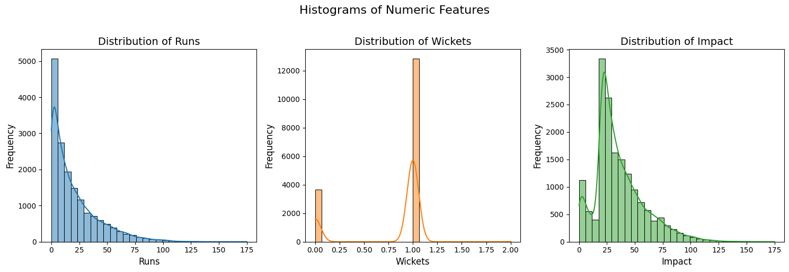
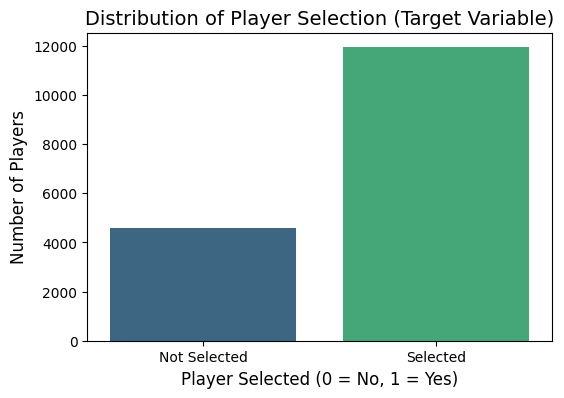
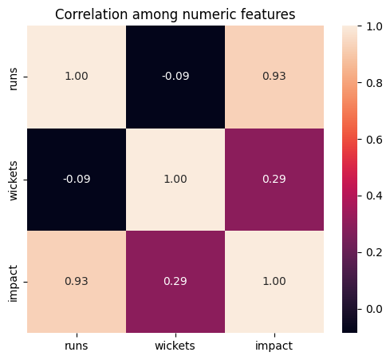
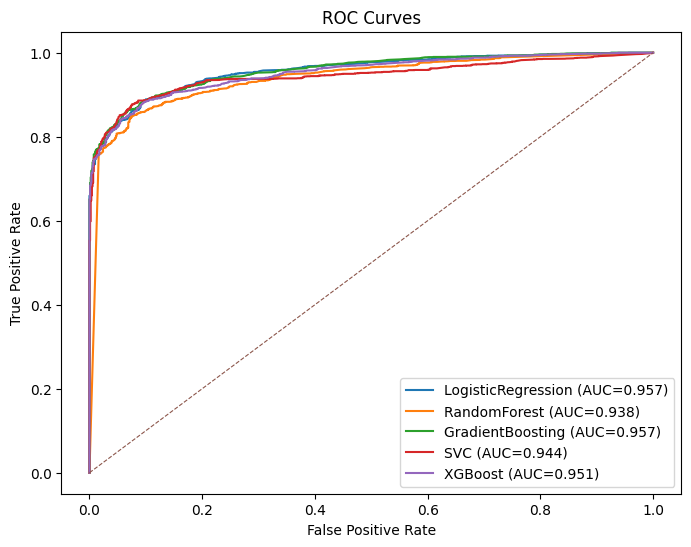

# 🏏 IPL Team Optimizer: A Machine Learning Approach to Squad Selection

## 📌 Project Overview
The objective of this project is to automate the selection of a "Playing XI" for IPL matches using historical performance data. This is a binary classification problem where the model predicts the likelihood of a player being selected for an optimal squad based on their career metrics and match-day impact.

## 🛠️ Technical Workflow

### 1. Data Preprocessing & Feature Engineering
* **Data Integration:** Aggregated raw ball-by-ball data into player-match performance tables.
* **Handling Imbalance:** Applied **SMOTE (Synthetic Minority Over-sampling Technique)** to address the class imbalance in the target variable, ensuring the model doesn't bias toward "Not Selected."
* **Feature Selection:** Focused on high-impact variables: `runs`, `wickets`, and a custom `impact` score.

| Feature Distributions | Target Class Balance (Post-SMOTE) |
| :---: | :---: |
|  |  |

### 2. Exploratory Data Analysis (EDA)
Multivariate analysis revealed a strong correlation (0.93) between runs and the calculated impact score, while wickets remained an independent but crucial factor for bowlers.

### 3. Model Architecture & Evaluation
I evaluated five different classifiers to determine the best fit for this predictive task:

| Model | Accuracy | Precision | Recall | ROC-AUC |
| :--- | :--- | :--- | :--- | :--- |
| **Gradient Boosting** | **88.2%** | 0.968 | 0.865 | 0.957 |
| **Random Forest** | 87.7% | 0.946 | 0.879 | 0.938 |
| **XGBoost** | 87.3% | 0.967 | 0.853 | 0.951 |
| **SVC** | 87.4% | 0.977 | 0.846 | 0.944 |
| **Logistic Regression** | 87.1% | 0.969 | 0.847 | 0.956 |

**Key Finding:** Gradient Boosting provided the best balance between precision and recall, crucial for ensuring that high-performing players aren't overlooked.

#### ROC Curve Comparison

---

## 🏆 Final Output: The Optimal XI
The system generates a roster based on predicted win probabilities. Below is a sample prediction for **Mumbai Indians vs. Chennai Super Kings**.

## 🚀 Key Takeaways for Recruiters
* **End-to-End Pipeline:** Built the entire pipeline from raw data cleaning to model deployment.
* **Problem Solving:** Addressed data imbalance issues using SMOTE to improve model robustness.
* **Model Explainability:** Used Confusion Matrices and Feature Importance to validate model decisions.

---
## 📂 Repository Structure
* `/assets`: Descriptive model visualizations and evaluation plots.
* `ipl_team_optimizer.py`: Main processing and prediction script.
* `ml_project.ipynb`: Full research, training, and testing notebook.
